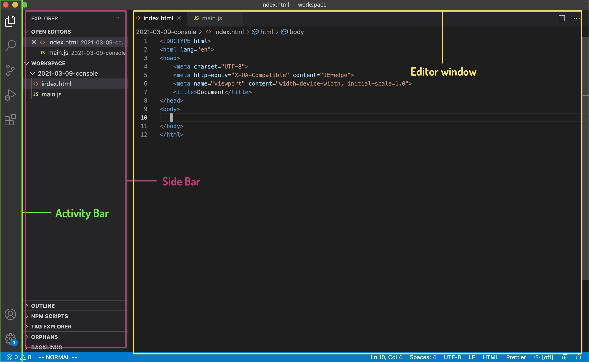

<!-- .slide: id="lesson3" -->

# Basic Frontend - Spring 2021

Lesson 3, Tuesday, 2021-03-09

---

### Homework 

<!-- .slide: style="font-size:70%" -->

```js
let pricePerTicket = 8;
let friends = 3;
let totalPrice = friends * pricePerTicket;
```

* Copy/paste this code and look at the `totalPrice` variable in the console.
* Can you modify the code above to also include the price for popcorn?
* A fourth friends wants to join. What do you need to do in the code above to compute the total price for 4 friends?
* Create a new variable containing your total budget (30 EUR).
* Create a new variable that contains `true` if the budget is high enough for cinema, `false` otherwise.

---

### From the console to VSCode

So far we've seen how to run small bits of JavaScript in the developer tools and/or directly into the `console`.

When to use the console:

- perform simple and small calculations
- quickly test single lines of code
- check error messages
- basic debugging (we'll see it today)

---

### From the console to VSCode

The `console` is not meant for coding.

The same way as we write `HTML` in a separate `.html` file, we write our JavaScript programs/scripts in a `.js` file.

---

### From the console to VSCode
#### VSCode interface

 <!-- .element style="width: 800px;" -->

---

### Our first JavaScript program

1. open VSCode
1. create a new folder named `2021-03-09` (or however you prefer)
1. create a new file (File -> New file)
1. save it as `main.js`
1. inside the file write `console.log("Hello world!");`

We'll see soon what `console.log()` is.
<!-- .element: class="fragment" -->


---

### Our first JavaScript program

What do we do now?

In order to run our program inside the browser, we have to somehow connect it to an `HTML` page
<!-- .element: class="fragment" -->

Let's create one!
<!-- .element: class="fragment" -->

---

### Our first JavaScript program

1. inside the same folder in VSCode create a new file
1. save it as `index.html`
1. inside, create an empty HTML page (next slide) 

---

### Our first JavaScript program

```html
<!DOCTYPE html>
<html>
  <body>
  </body>
</html>
```

We have an empty `HTML` page now. One more step to link our script to the page.

---

### Our first JavaScript program

Let's add this single line at the end of the `<body>` element

```html
<!DOCTYPE html>
<html>
  <body>

    <script src="main.js"><script>
  </body>
</html>
```

Load the page in the browser and check the console.

---

### The script tag

```html
<script src="main.js"></script>
```

- very similar to the `` tag
- we use the `src` attribute to specify the JavaScript file we want to load on the page
- we can put it anywhere in the HTML document, but it's good practice to put it at the end of the `<body>`

---

### From VSCode the console

Let's try to run our cinema program.

Write the code below in the `main.js` file and reload the page

```js
let pricePerTicket = 8;
let friends = 4;
let popcornPrice = 10;
let totalBudget = 30;
let totalPrice = friends * (pricePerTicket + popcornPrice);
let canGoToCinema = totalBudget >= totalPrice;
```

Did it work?
<!-- .element: class="fragment" -->

---

### From VSCode to the console

So far we've been working directly inside the JavaScript console in the browser.

It meant that to run our code and see a result or a response from JavaScript we didn't need to do anything special.
<!-- .element: class="fragment" -->

Now that our code is inside a script we have to be explicit about showing stuff in the console.
<!-- .element: class="fragment" -->

---

### Using console.log()

We use `console.log()` to tell our program to print/write/output something in the console.

Let's try it:

```js
let pricePerTicket = 8;
let friends = 4;
let popcornPrice = 10;
let totalBudget = 30;
let totalPrice = friends * (pricePerTicket + popcornPrice);
let canGoToCinema = totalBudget >= totalPrice;

console.log(canGoToCinema);
```

---

### Using console.log()

We can do better than that.

We've seen that the `+` operator can be used on strings to combine them.

Let's try to make our output a bit nicer:

```js
let pricePerTicket = 8;
let friends = 4;
let totalPrice = friends * pricePerTicket;

console.log("I'm planning to go to the cinema with " + friends + " friends.");
console.log("A ticket costs " + pricePerTicket + "€");
console.log("In total, we would spend " + totalPrice + "€");
```

---

### Exercise

- create a few variables with information about you (even fake ones)
    - for example: name, age, city of birth, hobbies
- use console.log() to write a short introduction

Example output:

```js
Hello, my name is Carlo.
I come from Italy. 
I live in Berlin.
I like books, comics and playing the guitar.
```

---

### Solution 

```js
let name = "Carlo";
let placeBirth = "Italy";
let placeLive = "Berlin";
let hobbiesText = "books, comics and playing guitar";

console.log("Hello, my name is " + name + ".");
console.log("I come from " + placeBirth + "."); 
console.log("I live in " + placeLive + ".");
console.log("I like " + hobbiesText + ".");
```

---

### Debugging with console.log()

Debugging: the process of finding and (possibly) fixing bugs (errors) in our program.

We'll learn proper debugging techniques in a more advanced lesson.
<!-- .element: class="fragment" -->

For now we can use `console.log()` to keep track of a variable to see how it changes while our program runs.
<!-- .element: class="fragment" -->


---

### Debugging with console.log()

Let's see an example:

```js
let a = 2;
let b = 3;
let c = a + b * 4;
a += c * b;
b = a * 2 - c;
```

Besides being a useless program, it's a bit hard to read.

What's the value of `b` at the end?

---

### Debugging with console.log()

```js
let a = 2;
let b = 3;
let c = a + b * 4;
a += c * b;
console.log("a " + a);
console.log("b " + b);
console.log("c " + c);
b = a * 2 - c;
console.log("b " + b);
```

---

### Printing multiple values with console.log() 

We can use `console.log()` to print multiple values at once, simply by separating them with a comma.

```js
let a = 5;
let b = 7;
let c = a + b * 4;
a += c * b;
console.log("a", a, "b", b, "c", c);
b = a * 2 - c;
console.log("b", b);
```

---

### Commenting our code

In JavaScript (and in programming in general) comments are short texts to add extra information to our code.  

Comments are meant only for who writes or reads the code, and are completely ignored by JavaScript.

```js
// Average: divide the sum of a set of numbers by the number of values
// for example, if we have 4 numbers, we have to divide the sum by 4
let average = (2 + 6 + 3 + 9) / 4;
```

---

### Commenting our code

Two type of comments:

```js
// this is a one line comment
// another one line comment
// anything after // is ignored by JavaScript

/*
    This is
    a multi-line
    comment
*/

let a = 5; // I can put comments mostly everywhere
```

Use comments only to add important information that is not already clear from reading the code.

---

### Try it for yourself

1. Open again the cinema exercise
1. comment a few lines of your choice
1. run the code again and see the difference

---

### Exercise: Simple shop

<!-- .slide: style="font-size:80%" -->

- you have a shop that sells: shirts (12.99 €), pants (18.99 €), skirts (15.99 €), socks (5.99 €), shoes (25.99 €)
- a customer has 100 € and buys 2 pair of pants, 1 shirt and 1 pair of shoes
- shipping costs are 9.99 €

Create variables with proper names for every known data.

Calculate:
- total spent by the customer (including shipping costs)
- money left for the customer

Format and print the results to the console.

---

### Bonus exercise: swap variables 

Given 2 variables containing numbers, can you swap the values between them?

```js
let a = 5;
let b = 10;

console.log("Values of a and b are", a, b); // this prints 5 and 10

// Swap values here...

console.log("Now the values of a and b are", a, b); // this should print 10 and 5

```

If needed, ask us for a hint.
