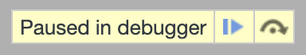
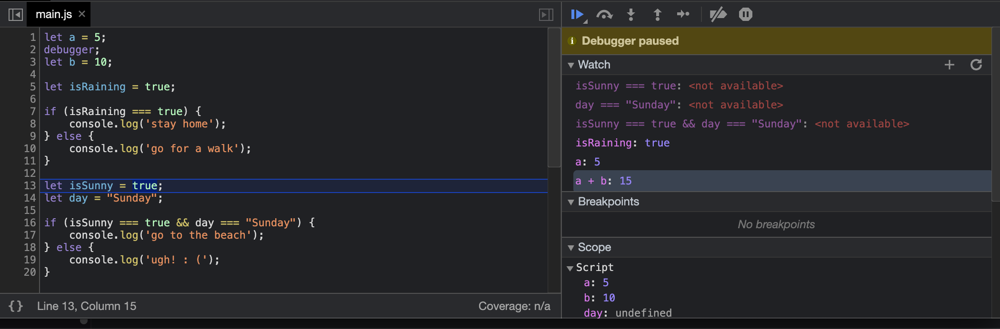

<!-- .slide: id="lesson6" -->

# Basic Frontend - Spring 2021

Lesson 6, Tuesday, 2021-03-16

---

### Recap 

What are their values?

```js
let a = 2 + 10; // ?
let b = a + 2; // ?

let c = 2;
c += 3; // ?
c + 1;
c += 4; // ?

let d = 9;
d *= 2; // ?
d++; // ?
```

---

### Recap 

```js
let a = 2 + 10; // a => 12 
let b = a + 2; // b => 14 

let c = 2;
c += 3; // c => 5 
c + 1;
c += 4; // c => 9 

let d = 9;
d *= 2; // c => 18
d++; // d => 19
```

---

### Recap

What's the value of `canDrive`?

```js
let age = 22;
let canDrive = age >= 18; // ?
```

---

### Recap

```js
let age = 22;
let canDrive = age >= 18; // true
```

---

### Recap

What does it print to the console?

```js
let day = "Sunday";

if (day === "Saturday" || day === "Sunday") {
    console.log("sleep zzz");
} else {
    console.log("wake up and go to work : (");
}
```

Answer: "sleep zzz"
<!-- .element: class="fragment" -->

---

### Recap

What does it print to the console?

```js
let time = 12;

if (time = 16) {
    console.log("zoom call");
} else {
    console.log("keep working");
}
```

Answer: "zoom call", but there's a bug
<!-- .element: class="fragment" -->

---

### Recap

Correct version:

```js
let time = 12;

if (time === 16) {
    console.log("zoom call");
} else {
    console.log("keep working");
}
```

---

# Debugger

---

### Debugging: intro

Debugging is the process of finding and fixing bugs.

`console.log()` ban be used to follow the program flow line by line and check values. 

Better than nothing, but it's a very basic form of debugging. 


---

### Debugging: intro

The code below has a few issues. We can put `console.log()` where needed to see how variables change values.

```js
let people = 9;
let ticketPrice = 8;
let popcornPrice = 10;
let drinksPrice = 5;
let promotionDiscount = 2;

let costs = ticketPrice + popcornPrice;
let total = costs - promotionDiscount * people;
console.log("costs", costs, "total", total);

people++;

total = total + ticketPrice;
total = drinksPrice * 3 + popcornPrice * 2;
console.log("total", total);

console.log("Total is " + total);
```

---

### Debugging: intro

`console.log()`

- very easy to use 
- might be enough for very short and simple programs 
- overall, a bit limited

---

### Debugging: intro

What are bugs, anyway?

In very general terms a bug is an error in our program
<!-- .element: class="fragment" data-fragment-index="1" -->

```js
let firstName = "Carlo";
console.log(frstName);
```
<!-- .element: class="fragment" data-fragment-index="1" -->

What's wrong with the code above?
<!-- .element: class="fragment" data-fragment-index="2" -->

---

### Debugging: intro

We are trying to use a variable that doesn't exist.

```js
let firstName = "Carlo";
console.log(frstName);
```

The code is not valid and JavaScript stops its execution showing us an error.
<!-- .element: class="fragment" -->

Sadly, things are not always this simple.
<!-- .element: class="fragment" -->

---

### Debugging: intro

The code below is perfectly valid: JavaScript has nothing to complain about.

Still, it contains a kind of dangerous bug. Can you spot it?

```js
let time = 12;

if (time = 16) {
    console.log("zoom call");
} else {
    console.log("keep working");
}
console.log(time);
```

---

### Debugging: intro

Going back to the definition of bugs: bugs are errors in our program.

In such situations (and many more), JavaScript will stop its execution and show an error:

- trying to use a variable that does not exist
- trying to define two variables with the same name
- omitting parenthesis in an if...else statement
- invalid operations like `2 = 2`

---

### Debugging: intro

```js
console.log(fullName);

let firstName = "Carlo";
let firstName = "Harald";

let isRaining = true;
if (isRaining === true {
    console.log("take an umbrella");
}

2 = 2;

```

---

### Debugging: intro

Some errors are more subtle. 

Code is valid, it looks correct, but it behaves in unexpected ways.

```js
let temperature = 37;

if (temperature > 20) {
  console.log("it's warm");
} else if (temperature > 30) {
  console.log("too hot!!!");
} else if (temperature > 5) {
  console.log("perfect.");
} else {
  console.log("it's a bit chilly.")
}
```

---

### Debugging: intro

More often than not, bugs are errors in the logic of our programs.

- hard to even realise there is a bug in the first place
    - JavaScript can't warn us
    - we don't notice them until something goes wrong or unexpectedly
- hard to find where the bug is in our code
    - a bug can be caused by a completely different line in our code
- hard to fix, even after realising we have a bug and finding where it is

---

### Debugging: intro

In an ideal world we would be able to pause the execution of our program at any point in time and check everything that's going on.

And surprisingly, we live in that world!
<!-- .element: class="fragment" -->

---

### Debugging: the debugger keyword 

We can use the `debugger` keyword to tell JavaScript where to pause its execution.

```js
let a = 0;
a++;
debugger;
let b = a;
```

---

### Debugging: the debugger 

If our code contain a `debugger` statement and we open the browser console, we'll see this thing on top:

 <!-- .element: style="display: block; margin: auto;" -->

With this, we can follow JavaScript's execution.

---

### Debugging: the debugger 

If our code contain a `debugger` statement and we open the browser console, we'll see this thing on top:

 <!-- .element: style="display: block; margin: auto;" -->

With this, we can follow JavaScript's execution.

---

### Debugging: the debugger

 <!-- .element: style="width: 1000px; display: block; margin: auto;" -->

---

### Debugging: the debugger

When we pause JavaScript's execution, we can inspect the status of our program at that moment in time.

We can also use the `Watch` panel on the right to keep an eye on variables or whole expressions and see how they change.

---

### Debugging: try it yourself 

- Add a debugger statement somewhere in the code below and run it.
- add some variables and/or expression to `watch` and see their values changing

```js
let people = 9;
let ticketPrice = 8;
let popcornPrice = 10;
let drinksPrice = 5;
let promotionDiscount = 2;

let costs = ticketPrice + popcornPrice;
let total = costs - promotionDiscount * people;

people++;

total = total + ticketPrice;
total = drinksPrice * 3 + popcornPrice * 2;
```

---
