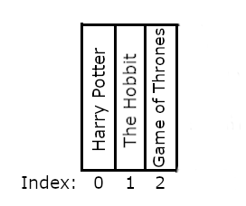

<!-- .slide: id="lesson10" -->

# Basic Frontend - Fall 2020

Lesson 10, Tuesday, 2020-09-29

---

### Recap: For vs. while

* We use a `for` loop if we know in advance how often it will be executed.

```js
for (let i = 0; i < 1000; i++) {
    console.log(i);
}
```

* We use a `while` loop if we don't know how many times the loop will be executed.

```js
while (isHungry) {
    eat();
}
```

---

### Refresher: Data Types

```js
// string
let name = "Owen";

// number
let age = 28;

// boolean
let isProgrammer = true;

// undefined
let doNotKnow;
```

---

<!-- .slide: id="lesson10:arrays" -->

## Arrays

---

### Arrays

An `array` is a container type that holds multiple values:

```js
// we create an empty array using []
let emptyArray = [];

// we put the values we want in square brackets
// separated by commas
let ages = [19, 33, 25, 40];
let cities = ["London", "Paris", "Berlin"];
```

---

Array can hold any type of value:

```js
let prices = [0.99, 1.49];
```

And any quantity:
```js
// I only have one favorite food
let favoriteFoods = ["Pizza"];
// An array holding 26 letters of the alphabet
let alphabet = ["a", "b", "c", "d", "e", "f", "g", "h", "i", "j", "k", "l"]; //TODO
```

---

### Analogy: Bookshelf

A bookshelf represents an array of books


```js
let books = ["Harry Potter", "The Hobbit", "Game of Thrones"];
```

---

### Accessing elements

We can access elements in the array by number using square brackets "`[]`"

The numbering starts at `0` (think floors of a building):

```js
let books = ["Harry Potter", "The Hobbit", "Game of Thrones"];

console.log(books[0]); // "Harry Potter"
console.log(books[1]); // "The Hobbit"
// QUIZ - how do we access "Game of Thrones" ?
```

```js
console.log(books[2]); // "Game of Thrones"
```
<!-- .element: class="fragment" -->
The order of elements in the array matters!
<!-- .element: class="fragment" -->


---

### Bookshelf array



---

### Invalid elements

```js
let books = ["Harry Potter", "The Hobbit", "Game of Thrones"];

console.log(books[0]); // "Harry Potter"
console.log(books[1]); // "The Hobbit"
console.log(books[2]); // "Game of Thrones"
console.log(books[3]); // ???
```

```js
console.log(books[3]); // undefined
```
<!-- .element: class="fragment" -->

---

### Quiz

```js
let friends = ["Alice", "Bob", "Carol"];

console.log(friends[1]); // ???
console.log(friends[3]); // ???
```

```js
console.log(friends[1]); // "Bob"
console.log(friends[3]); // undefined
```
<!-- .element: class="fragment" -->

---

### Exercise 1

* Step 1: Create an array with your 3 top friends
* Step 2: Say "hello" on console to each friend, e.g.:

```plaintext
hello Alice
hello Bob
hello Carol
```

---

### Solution

```js
let friends = ["Sevtap", "Carlo", "Abdullah"];
console.log("hello " + friends[0]);
console.log("hello " + friends[1]);
console.log("hello " + friends[2]);
```

---

### Modifying arrays

We can change any value using brackets:

```js
let friends = ["Alice", "Bob", "Carol"];

friends[1] = "David";
// friends array is now ["Alice", "David", "Carol"]

console.log(friends[1]); // "David"
```

---

### Common operations: array length

We can get the length of an array with the `.length` property:

```js
let friends = ["Alice", "Bob", "Carol"];
console.log(friends.length); // 3
```

---

### Iterating through an array

How can we make the code below more generic, for any array size?

```js
let cars = ["Saab", "Volvo", "BMW"];

console.log(cars[0]);
console.log(cars[1]);
console.log(cars[2]);
```

---

### Loops!

```js
let cars = ["Saab", "Volvo", "BMW"];

for (let i = 0; i < cars.length; i++) {
    console.log(cars[i]);
}
```

---

### Exercise 2

* Step 1: Create an array with your 3 top friends (you can use the same from exercise 1)
* Step 2: Say "hello" on console to each friend, using a `for` loop!

```
hello Alice
hello Bob
hello Carol
```

---

### Appending new values

We can append new values to an array using `.push()`:

```js
let friends = ["Alice", "Bob", "Carol"];
console.log(friends.length); // 3

friends.push("David");

console.log(friends.length); // 4
console.log(friends[3]); // David
```

---

### Exercise 3

Create a function that takes an array and outputs the following:

* Output the last element of the array
* Output the sum of all the numbers in the array
* Output the largest number of the array
* Output the average (mean) of all numbers (sum of all numbers divided by amount of numbers)

Create an array containing a few numbers, ex `[3, 2, 9, 5, 6]` and test your code:

```js
function exercise3(array) {
    // your code here
}
exercise3([3, 2, 9, 5, 6]);
```

<!-- .slide: style="font-size:70%" -->

---

### Bonus Exercise

* Create a new array containing only numbers of the original array that are smaller than 5
 * ex: given input `[1, 3, 7, 2, 9, 5]`, return `[1, 3, 2]`
* Write a function that takes a number and an array of numbers as input parameter. Return the index of the number if it is in the array, otherwise return `-1`
 * ex: given inputs `5` and `[2, 1, 5, 6, 3]`, return `2`

---

### Solution

```js
function exercise3(array) {
    console.log("last element: " + array[array.length - 1]);
    let sum = 0;
    for (let i = 0; i < array.length; i++) {
        sum += array[i];
    }
    console.log("sum: " + sum);
    let largest = array[0];
    for (let i = 1; i < array.length; i++) {
        if (array[i] > largest) {
            largest = array[i];
        }
    }
    console.log("largest number: " + largest);
    console.log("mean: " + sum / array.length);
}
exercise3([3, 2, 9, 5, 6]);
```
<!-- .slide: style="font-size:70%" -->

---

### Solution Bonus 1

```js
function lessThan5(arr) {
  let result = [];
  for (let i = 0; i < arr.length; i++) {
    if (arr[i] < 5) {
      result.push(arr[i]);
    }
  }
  return result;
}

let result = lessThan5([1, 3, 7, 2, 9, 5]);
console.log(result);
```

---

### Solution Bonus 2

```js
function find(num, arr) {
  for (let i = 0; i < arr.length; i++) {
    if (arr[i] === num) {
      return i;
    }
  }
  return -1;
}

console.log(find(5, [2, 1, 5, 6, 3]));
console.log(find(42, [2, 1, 5, 6, 3]));
```

