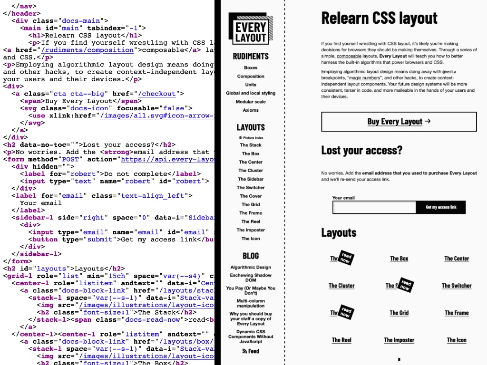
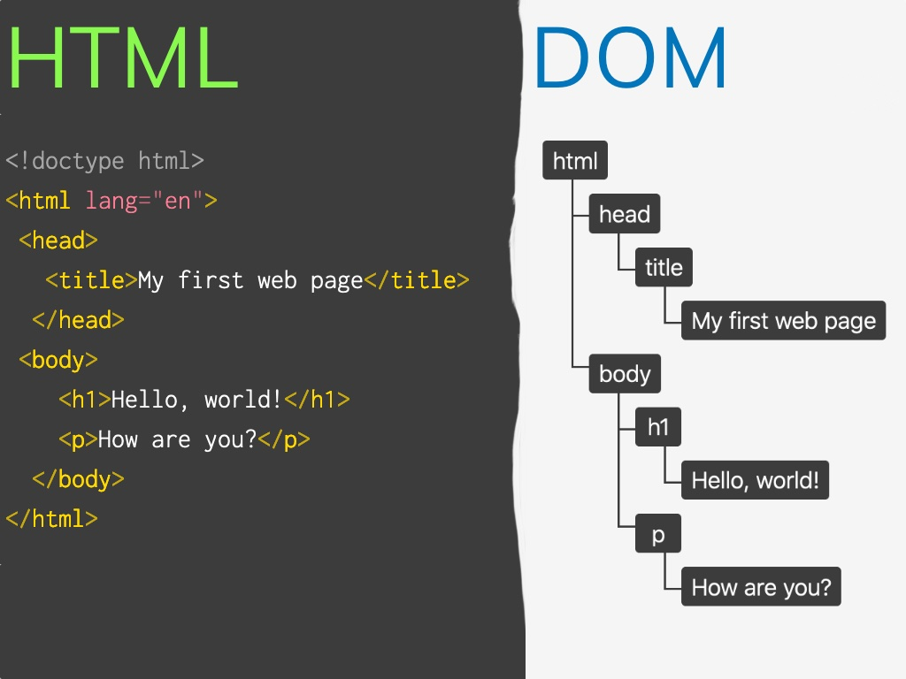
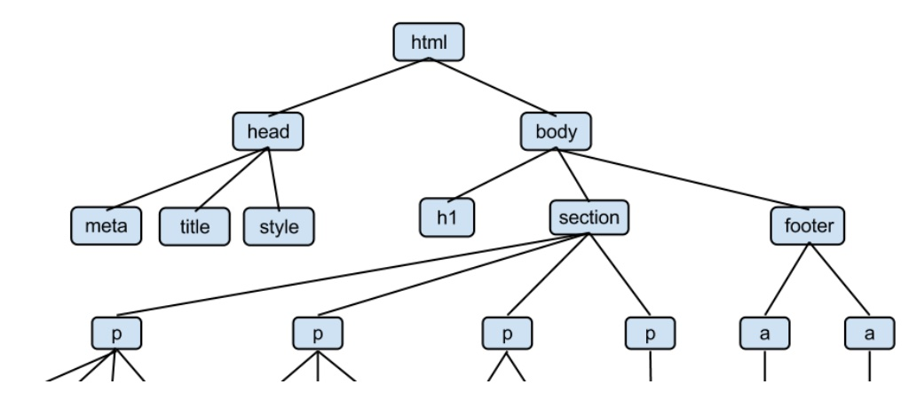
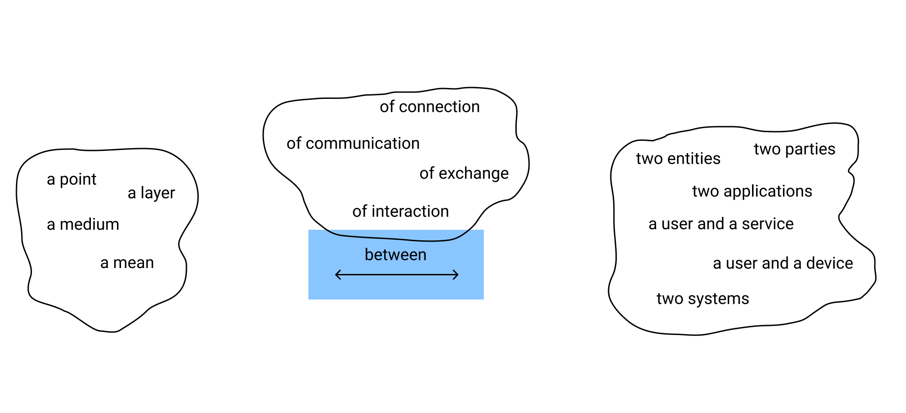
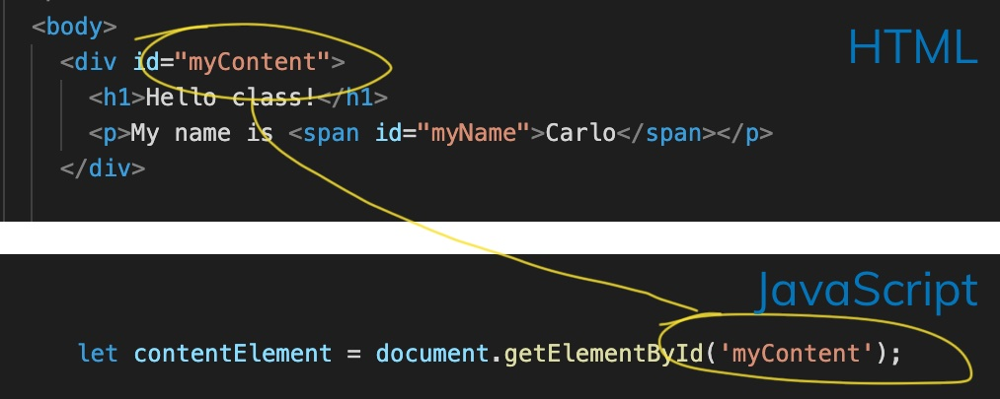

<!-- .slide: id="lesson12" -->

# Basic Frontend - Spring 2021

Lesson 12, Tuesday, 2021-04-13

---

Lesson overview:

- nested objects
- introduction to the DOM API
- interacting with HTML elements through the DOM API

---

### Homework solution

```js
let myCar = {
    model: "DeLorean DMC 12",
    engineIsWorking: true,
    wheelCount: 4,
    canBeDriven: function() {
        return this.engineIsWorking && this.wheelCount === 4;
    },
    serviceCar: function() {
        this.engineIsWorking = true;
        this.wheelCount = 4;
    }
};
```

---

### Recap: Objects

```js
let myObject = {
    a: 42,
    b: true,
    c: "hello",
    d: function () { return this.a; },
};
```

---

Objects consist of key-value pairs (properties)

For values, we used `number`, `boolean`, `string` or `function` (also called "member function").

Which other data type you think is possible as a property value?

`object`
<!-- .element: class="fragment" -->

---

```js
let me = {
    name: "Harald",
    address: {
        street: "ReDI Straße",
        city: "Berlin",
    }
}
```

How would we access the `street` and `city`?

---

```js
let me = {
    name: "Harald",
    address: {
        street: "ReDI Straße",
        city: "Berlin",
    }
}

console.log(me.address.street); // "ReDI Straße"
console.log(me.address.city); // "Berlin"

```

---

### Quiz

Can you come up with an object so that the following code is valid:

```js
let a = // ????
console.log(a.b.c); // "yay"
```

BONUS: add a property `d` so that the following code is valid:

```js
console.log(a.d().e); // "yippee"
```

---

### Solution

```js
let a = {
    b: {
        c: "yay"
    },
    d: function() {
        return { e: "yippee" }
    }
};
```

---

<!-- .slide: id="DOM" -->

## Introduction to DOM

---

### Static vs dynamic pages

Let's start with this small HTML document

```html
<!DOCTYPE html>
<html>
  <head>
    <title>Lesson 14</title>
  </head>
  <body>
    <h1>Hello class</h1>
    <p>My name is <span id="myName">Carlo</span>, and I wish this page was more interesting</p>
  </body>
</html>
```

---

### Static vs dynamic pages

Once I open this document in the browser, we see this simple, yet beautiful, page.

How can I interact with it?

 <!-- .element width="250px" style="display: block; margin: 0 auto;" -->

Not at all.
<!-- .element: class="fragment"  -->

---

### Static vs dynamic pages

- HTML documents are static by nature
- using CSS, we can change their appearance and make them (hopefully) prettier
- we can even animate them, to a certain extent
- but our possibilities of interaction are very limited

---

### Static vs dynamic pages

After the page is loaded in the browser:

1. can we change the background color?
1. can we change the color of the text?
1. can we replace one word with another?
1. can we replace a whole paragraph of text with another one?
1. can we add new content to the page? New words, links, images etc.?


---

### Static vs dynamic pages

The answer is "kind of", but mostly "no".

- with some basic CSS knowledge, we can change some colors when hovering on
  certain elements
<!-- .element: class="fragment"  -->
- with some CSS trickery we could also hide a word and show another one
<!-- .element: class="fragment"  -->
- we definitely can't add new content to the page
<!-- .element: class="fragment"  -->

And also, in the first two cases, we are only changing colors that we chose in
advance
<!-- .element: class="fragment"  -->

---

### Static vs dynamic pages

That's where JavaScript comes into play

With JavaScript we have full control over the page content.

We can make our pages dynamic.

---

### Static vs dynamic pages

Some of the things we can do with JavaScript

- change (not just hide or move around) the content of a page
- add new content to the page
- most of all: JavaScript can react to user actions

---

### The DOM API

- DOM stands for **D**ocument **O**bject **M**odel
- API stands for **A**pplication **P**rogramming **I**nterface

---

### The DOM API: the DOM


 <!-- .element width="600px" -->

How do we get from simple HTML to a website?

---

### The DOM API: the DOM

 <!-- .element width="500px" -->

The browser does a lot of things behind the scenes, one of which is reading
(parsing) the HTML code and transforming it into a "tree" of objects.

---

### The DOM API: the DOM tree

 <!-- .element width="400px"   -->

The DOM is a way of representing an HTML document.

- you can think of it as a tree (an upside-down one)
- the HTML element is its root, on top
- its descendants, the leaves, are the other HTML elements (h1, div, section, p, img etc.)

---

### The DOM API: the DOM tree

Everything inside the DOM is an object, so having an HTML document represented
as a list of objects is very convenient if we want to interact with it using
JavaScript.

We do that through the API part of the DOM.
<!-- .element: class="fragment"  -->

---

### The DOM API: interfaces

Let's focus on the I part of API: interface.

Can you think of some examples of interfaces from your daily life?
<!-- .element: class="fragment"  -->

- a keyboard, a numeric keypad, keys in an elevator
<!-- .element: class="fragment"  -->
- controls (play, stop, pause, back, forward) on a stereo, an iPod, Spotify
<!-- .element: class="fragment"  -->
- controls on a washing machine or a dishwasher
<!-- .element: class="fragment"  -->
- shower mixer (to regulate water temperature)
<!-- .element: class="fragment"  -->
- car steering wheel
<!-- .element: class="fragment"  -->
- even a waiter in a restaurant
<!-- .element: class="fragment"  -->

---

### The DOM API: interfaces

 <!-- .element width="500px" -->

---

### The DOM API: interfaces

An interface can be defined in many ways:

 <!-- .element width="800px" -->

---

### The DOM API: interfaces

Our main takeaways are:

- an interface allows communication between to subjects
<!-- .element: class="fragment"  -->
- an interface hides complexity
<!-- .element: class="fragment"  -->

In our case, the two subjects are our JavaScript code and the web page we want
to interact with. The complexity is all the work the browser does behind the
scene
<!-- .element: class="fragment"  -->

---

### The DOM API in practice: getting access to an element

Every operation in the DOM goes through the `document` object. And for now we
need only one function:

```js
document.getElementById();
```
 <!-- .element width="500px" -->

---

### The DOM API in practice: getting access to an element

So, let's try it out:

```js
let contentElement = document.getElementById('myContent');
console.log(contentElement);
```

It's an object!
<!-- .element: class="fragment"  -->

---

### The DOM API in practice: getting access to an element

Since it's an object, we can set/get properties.

Let's try the style property:

```js
let contentElement = document.getElementById('myContent');
contentElement.style.backgroundColor = "red";
```

---

### Let's practice

Create a HTML page with a button element:

```html
<body>
  <button id="myButton">Click me!</button>
</body>
```

Now try to set a HTML attribute from JavaScript:

```js
let myButtonElement = document.getElementById("myButton");
myButtonElement.disabled = true;
```

Bonus: Can you also set the background color of your button?
