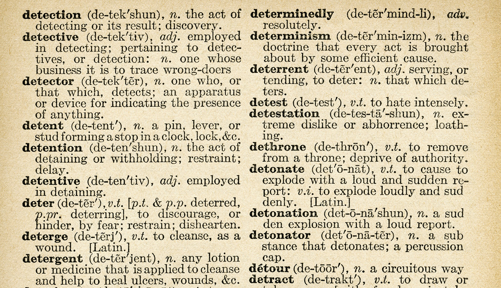

<!-- .slide: id="lesson12" -->

# Basic Frontend - Fall 2020

Lesson 12, Tuesday, 2020-10-06

---

### Lesson overview

* recap of JavaScript types
* introducing JavaScript objects
* differences between objects and arrays
* some practice

---

### Recap: types

What Javascript types have we seen so far?

* Number
<!-- .element: class="fragment" -->
* String
<!-- .element: class="fragment" -->
* Boolean
<!-- .element: class="fragment" -->
* Undefined
<!-- .element: class="fragment" -->

---

### Recap: types

```js
let age = 39;
let firstName = "Carlo";
let lastName = "Trimarchi";
let nationality = "Italian";
let cityOfBirth = "Messina";
let favouriteColor = "green";
let hairColor = "black";
let canSpeakGerman = false;
let isVegetarian = true;
let hadDinner = hour > 20; // false
```

What's missing?
<!-- .element: class="fragment" -->
* Array
<!-- .element: class="fragment" -->
* Function
<!-- .element: class="fragment" -->

---

### Recap: arrays

Let's focus on **arrays** for now

* can contain more than one value
<!-- .element: class="fragment" data-fragment-index="1" -->
* in general, can contain other data types, even other arrays
<!-- .element: class="fragment" data-fragment-index="2"-->
* good to represent lists of things
<!-- .element: class="fragment" data-fragment-index="3" -->


For example:
<!-- .element: class="fragment" data-fragment-index="4" -->
```js
let vowels = ['a', 'e', 'i', 'o', 'u'];
let someNumbers = [1, 2, 3, 4, 5, 6, 7, 8, 9, 10];
let shoppingList = ['eggs', 'broccoli', 'potatoes', 'sugar', 'flour'];
```
<!-- .element: class="fragment" data-fragment-index="4" -->


---

### Recap: types

```js
let age = 39;
let firstName = "Carlo";
let lastName = "Trimarchi";
let nationality = "Italian";
let cityOfBirth = "Messina";
let favouriteColor = "green";
let hairColor = "black";
let canSpeakGerman = false;
let isVegetarian = true;
let hadDinner = hour > 20; // false

let hobbies = ['reading', 'music', 'guitar'];
let favouriteFoods = ['pizza', 'pasta', 'lasagna'];
```

That's good enough!
But would it be possible to store all this data into an array?
<!-- .element: class="fragment"  -->

---

### Recap: types

```js

let me = [39, "Carlo", "Trimarchi", "Italian", "Messina",
          "green", "black", false, true, hour > 20,
          ['reading', 'music', 'guitar'],
          ['pizza', 'pasta', 'lasagna']];
```

It is possible, but it's a mess.
<!-- .element: class="fragment"  -->

---

<!-- .slide: id="lesson12:objects" -->

## Objects

---

### Objects

An **object**, in Javascript, is a group (or a list) of *key* / *value* pairs

 <!-- .element width="300" style="display: block; margin: 0 auto; width: 300px;" -->


---

### Objects

Example:

```js
let person = {
  firstName: 'Carlo',
  lastName: 'Trimarchi',
  age: 39
};
```

Can you guess how we can create an object?

---

### Objects

To create an object we use curly braces `{}`.
```js
let emptyObject = {};
```

We put any key/value pair inside the `{}`

```js
let person = {
  name: 'Carlo'
  // the key is 'name', the value is 'Carlo'
};
```

---

### Objects

We can think of key/value pairs as words in a dictionary

 <!-- .element width="500" style="display: block; margin: 0 auto;" -->

* a word is the **key**
* the definition is the **value**

---

### Objects

key/value pairs are also referred to as **properties**

```js
let person = {
  firstName: 'Carlo', // comma here
  age: 39, // also here
  isVegetarian: true // this is the last one, no comma
};
```
* can you list all the properties in this **person** object?
* and its keys?
* and its values?

We can add as many properties as we want.
<!-- .element: class="fragment"  -->

---

### Objects: examples

```js

let book = {
  title: 'The Lord of the Rings',
  author: 'J. R. R. Tolkien',
  publicationYear: 1954,
  pages: 1216
};

```

Can you think of other things we can represent with objects?
<!-- .element: class="fragment"  -->

---

### Objects: examples

* movies
<!-- .element: class="fragment"  -->
* passport / identity card
<!-- .element: class="fragment"  -->
* cooking recipe
<!-- .element: class="fragment"  -->
* product in an e-commerce
<!-- .element: class="fragment"  -->
* much more...
<!-- .element: class="fragment"  -->

---

### Objects: exercise

Try it yourself:

create an object called "`me`" containing the following information about you:
* name
* age
* hair color
* eye color

Log your object to the console

---

### Objects vs arrays

```js
let meArray = [39, "Carlo", "Trimarchi", "Italian", "Messina",
          "green", "black", false, true,
          ['reading', 'music', 'guitar'],
          ['pizza', 'pasta', 'lasagna']];

let me = {
  age: 39,
  firstName:  "Carlo",
  lastName:  "Trimarchi",
  nationality:  "Italian",
  cityOfBirth:  "Messina",
  favouriteColor:  "green",
  hairColor:  "black",
  canSpeakGerman:  false,
  isVegetarian:  true,
  hobbies:  ['reading', 'music', 'guitar'],
  favouriteFoods:  ['pizza', 'pasta', 'lasagna']
};
```

Objects let us give **structure** and **meaning** to our data

---

### Objects: functions

We can also add functions as properties!

```js
let dog = {
  name: "Bob",
  breed: "beagle",
  age: 3,
  speak: function() {
    console.log("Woof! Woof!");
  },
  eat: function(food) {
    console.log("I just ate some nice " + food);
  },
};

let mathStuff = {
  PI: 3.14,
  square: function(x) {
    return x * x;
  },
  half: function (x) {
    return x / 2;
  }
};
```

---


### Objects: accessing properties

Okay, now we created an object, what can we do with it?

```js
// we can access the value of a property using the . operator
let myName = me.name;

// we can also change the value
me.age = 10;

// we have used 'console.log' for a while now,
// 'console' is an object that the browser creates for us
// and 'log' is a function defined on that object
console.log(myName);
```

---

### Objects: accessing properties

what would happen here?

```js
let person = {
  name: 'John!',
  age: 25,
  isMarried: false
};

console.log(person.numChildren); // ????
person.lastName = 'Smith'; // ????
person.isMarried(); // ????
```

---

Solutions

```js
let person = {
  name: 'John!',
  age: 25,
  isMarried: false
};

console.log(person.numChildren); // undefined

// this is correct, we added a new property: 'lastName'
// with the value of 'Smith' to our person object
person.lastName = 'Smith';

//ERROR! isMarried is a boolean, it is not a function!
person.isMarried();
```

---

### Objects: recap

What have we learned so far about objects?

* similarly to arrays, objects can contain a list of values
* object values are called **properties**, and they are key/value pairs
* instead of using indexes, we access objects' properties through its **keys**

---

### Objects and arrays use cases

What can we use objects and arrays for?

* objects are useful to represent entities, both real (books, movies, people,
  products, etc.) and abstract (the console Javascript object)
* through object properties we can describe those entities
* we can use arrays to store a list of things
* we can have arrays inside objects
* even more interestingly, we can have objects inside of arrays, so a list of
  objects

---

### Objects and arrays

```js
let books = [
  {
    title: "Frankenstein",
    author: "Mary Shelley",
  },
  {
    title: "The Lord of the Rings",
    author: "J. R. R. Tolkien",
  },
  {
    title: "The Handmaid's Tale",
    author: "Margaret Atwood",
  },
  {
    title: "The Metamorphosis",
    author: "Franz Kafka",
  },
];
```

Can you loop through this array and print all the titles to the console?

---

### Objects: exercise

Solve the friends introduction exercise again, but this time use objects for the friends instead of arrays.

```js
// use objects instead of these arrays
// ['John Carmack', 'Frances Northcutt', 'John Nash'];
// [23, 25, 66];

// don't forget to loop over the objects and introduce everyone.
```
---
