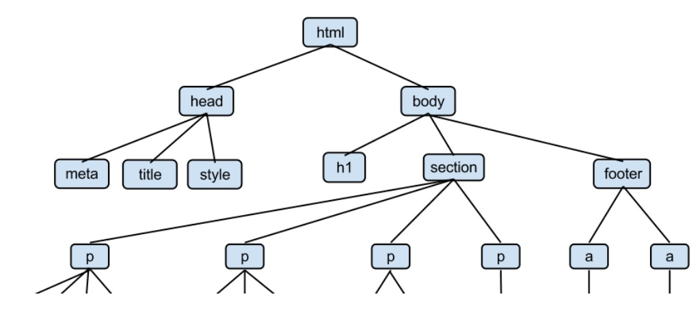
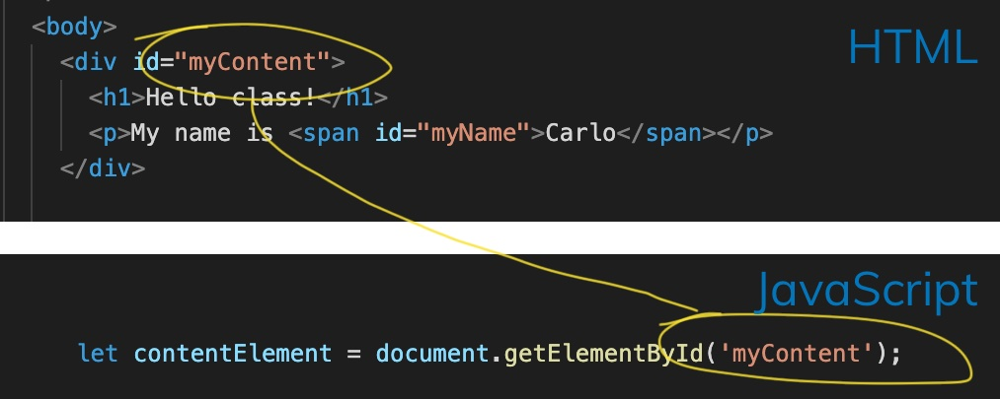

<!-- .slide: id="lesson13" -->

# Basic Frontend - Spring 2021

Lesson 13, Thursday, 2021-04-15

---

<!-- .slide: id="DOM" -->

## Introduction to DOM

---

### Static vs dynamic pages

Let's start with this small HTML document

```html
<!DOCTYPE html>
<html>
  <head>
    <title>Lesson 14</title>
  </head>
  <body>
    <h1>Hello class</h1>
    <p>My name is <span id="myName">Carlo</span>, and I wish this page was more interesting</p>
  </body>
</html>
```

---

### Static vs dynamic pages

Once I open this document in the browser, we see this simple, yet beautiful, page.

Can we interact with it?

 <!-- .element width="500px" style="display: block; margin: 0 auto;" -->

No. Not at all.
<!-- .element: class="fragment"  -->

---

### Static vs dynamic pages

- HTML documents are static by nature
- using CSS, we can change their appearance and make them (hopefully) prettier
- we can even animate them, to a certain extent
- but our possibilities of interaction are very limited

---

### Static vs dynamic pages

After the page is loaded in the browser:

1. can we change the background color?
1. can we change the color of the text?
1. can we replace one word with another?
1. can we replace a whole paragraph of text with another one?
1. can we add new content to the page? New words, links, images etc.?


---

### Static vs dynamic pages

The answer is "kind of", but mostly "no".

- with some basic CSS knowledge, we can change some colors when hovering on certain elements
<!-- .element: class="fragment"  -->
- with some CSS trickery we could also hide a word and show another one
<!-- .element: class="fragment"  -->
- we definitely can't add new content to the page
<!-- .element: class="fragment"  -->

And also, in the first two cases, we are only changing colors that we chose in advance
<!-- .element: class="fragment"  -->

---

### Static vs dynamic pages

That's where JavaScript comes into play

With JavaScript we have full control over the page content.

We can make our pages dynamic.

---

### Static vs dynamic pages

Some of the things we can do with JavaScript

- change (not just hide or move around) the content of a page
- add new content to the page
- most of all: JavaScript can react to user actions

---

### The DOM API

- DOM stands for **D**ocument **O**bject **M**odel
- API stands for **A**pplication **P**rogramming **I**nterface

---

### The DOM API: the DOM


 <!-- .element: class="center-img" width="600px" -->

How do we get from simple HTML to a website?

---

### The DOM API: the DOM

 <!-- .element: class="center-img" width="500px" -->

The browser does a lot of things behind the scenes, one of which is reading (parsing) the HTML code and transforming it into a "tree" of objects.

---

### The DOM API: the DOM tree

 <!-- .element: class="center-img" width="400px"   -->

The DOM is a way of representing an HTML document.

- you can think of it as a tree (an upside-down one)
- the HTML element is its root, on top
- its descendants, the leaves, are the other HTML elements (h1, div, section, p, img etc.)

---

### The DOM API: the DOM tree

Everything inside the DOM is an object, so having an HTML document represented as a list of objects is very convenient if we want to interact with it using JavaScript.

We do that through the API part of the DOM.
<!-- .element: class="fragment"  -->

---

### The DOM API: interfaces

Let's focus on the I part of API: interface.

Can you think of some examples of interfaces from your daily life?
<!-- .element: class="fragment"  -->

- a keyboard, a numeric keypad, keys in an elevator
<!-- .element: class="fragment"  -->
- controls (play, stop, pause, back, forward) on a stereo, an iPod, Spotify
<!-- .element: class="fragment"  -->
- controls on a washing machine or a dishwasher
<!-- .element: class="fragment"  -->
- shower mixer (to regulate water temperature)
<!-- .element: class="fragment"  -->
- car steering wheel
<!-- .element: class="fragment"  -->
- even a waiter in a restaurant
<!-- .element: class="fragment"  -->

---

### The DOM API: interfaces

 <!-- .element: class="center-img" width="500px" -->

---

### The DOM API: interfaces

An interface can be defined in many ways:

 <!-- .element width="800px" -->

---

### The DOM API: interfaces

Our main takeaways are:

- an interface allows communication between two subjects
<!-- .element: class="fragment"  -->
- an interface hides complexity
<!-- .element: class="fragment"  -->

In our case, the two subjects are our JavaScript code and the web page we want to interact with. The complexity is all the work the browser does behind the scene
<!-- .element: class="fragment"  -->

---

### The DOM API: interfaces

Remember the page I had at the beginning?


 <!-- .element: class="center-img" width="500px" -->

Let's enhance it!

---

### The DOM API in practice 

Interacting with an element on a web page is normally a 2-step process.

Let's take as an example changing the background of a `div`. The two steps involved are:

1. getting access to the div element
1. changing one of its properties, specifically the `backgroundColor`


---

### The DOM API in practice: getting access to an element

Every operation in the DOM goes through the `document` object. And for now we need only one function:

```js
document.getElementById();
```
 <!-- .element: class="center-img" width="500px" -->

---

### The DOM API in practice: getting access to an element

So, let's try it out:

```js
let contentElement = document.getElementById('myContent');
console.log(contentElement);
```

---

### The DOM API in practice: getting access to an element

Since it's an object, we can set/get its properties.

Let's try the style property:

```js
let contentElement = document.getElementById('myContent');
contentElement.style.backgroundColor = "red";
```

---

### The DOM API in practice: the style property

The `style` property is an object with many nested objects inside: it contains every CSS property you normally use in a stylesheet.

The difference is that in the DOM API the names are slightly different:

- background-color -> backgroundColor
- font-family -> fontFamily
- border-color -> borderColor
- color -> color

---

### The DOM API in practice: the style property

We can use the style property to access the backgroundColor property and change it:

```js
let contentElement = document.getElementById('myContent');
contentElement.style.backgroundColor = 'red';
```

---

### The DOM API in practice: the style property

Give it a try:

1. create a div with the id `myDiv`
1. write something in it
1. in JavaScript, get access to the div
1. change its color

---

### The DOM API in practice: the style property

We can do the same with the body element of the page.

```js
document.body.style.backgroundColor = 'green';
```

The "body" is already part of the document object, so we can access it directly without needing an id.
<!-- .element: class="fragment"  -->

---

### The DOM API in practice: reading element attributes

This is nice, but still not really dynamic.

The goal was to get the color from an input field in our page.

Let's see how we can do that.

---

### The DOM API in practice: element attributes

In my HTML I have this input:
```html
<input type="text" id="pageBackgroundInput" value="red">
```

We can access it in JavaScript:

```js
// get a reference to the input element
let inputElement = document.getElementById('pageBackgroundInput');
// read its "value" attribute
let newColor = inputElement.value;
console.log(newColor); // outputs "red"
// set the body "backgroundColor" equal to "newColor"
document.body.style.backgroundColor = newColor;
```

---

### The DOM API in practice: changing color onclick 

Let's put all of that into a function

```js
function changePageBackground() {
  // get a reference to the input element
  let inputElement = document.getElementById('pageBackgroundInput');
  // read its "value" attribute
  let newColor = inputElement.value;
  console.log(newColor); // outputs "red"
  // set the body "backgroundColor" equal to "newColor"
  document.body.style.backgroundColor = newColor;
}
```

How can we call this function when clicking a button?

---

### The DOM API in practice: changing color onclick 

How can you connect a function to an HTML button?

```html
<input type="text" id="pageBackgroundInput" />
<button onclick="changePageBackground()">Change</button>
```
<!-- .element: class="fragment"  -->

---

### The DOM API in practice: recap

1. we use document.getElementById() to access HTML elements through their ids
1. we can access the HTML body directly using document.body
1. the style object contains all the CSS properties

How can we change the text content inside HTML elements?
<!-- .element: class="fragment"  -->

---

### The DOM API in practice: recap

```html
<p>My name is <span id="myName">Carlo</span></p>
```

Instead of changing style, we change the textContent property
```js
let inputElement = document.getElementById("myNameInput");
let nameElement = document.getElementById("myName");
let newName = inputElement.value;
nameElement.textContent = newName;
```

---

### Exercise 1: 

Create an HTML page with a button element:

```html
<body>
  <button id="myButton">Click me!</button>
</body>
```

Now try to set an HTML attribute from JavaScript:

```js
let myButtonElement = document.getElementById("myButton");
myButtonElement.disabled = true;
```

Bonus: Can you also set the background color of your button?

---

### Exercise 2:

Color Scheme Selector

Follow the instructions inside the `main.js` file to create 2 buttons that change the color scheme of the page.

Bonus: create an extra button that sets a new color scheme with your choice of colors

---

### Exercise 3:

- open a favourite website of yours and look for an example of something on that page that might be represented by a JavaScript object.
- create a JavaScript object to represent that

For example: https://www.goodreads.com/ is a website that I use for tracking books I've read and that I want to read. An individual book from there can be easily represented by an object. 

---
