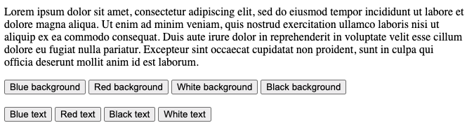
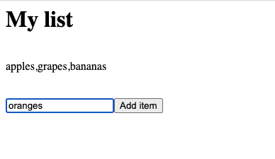
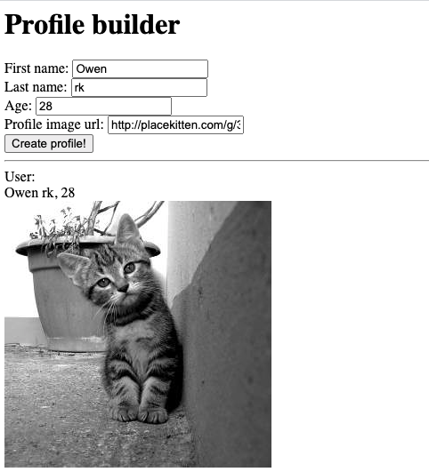

<!-- .slide: id="lesson15" -->

# Basic Frontend - Fall 2020

Lesson 15, Thursday, 2020-10-15

---

### Recap: DOM

1. What is the DOM? How is it represented?
1. What does the DOM API provide to us, the developer?

---


```html
<input type="text" value="hello" />
```
How can I get this input element in JavaScript?

```html
<input type="text" value="hello" id="myInput" />
```
<!-- .element: class="fragment" -->

```js
let input = document.getElementById("myInput");
input.value = "world";
```
<!-- .element: class="fragment" -->

---

### DOM Exercise 1

Create a control panel of buttons (say, 8 buttons) that change:
* The background color
* The font color used on the page.

Each button should indicate what it does (ex: "blue background", "green text")

---

### DOM Exercise 1



---

### DOM Exercise 2: Simple list builder

Create a page with:
 * an input with id `myInput`
 * a button
 * a div with id `displayText`

When the user enters a value into the input and clicks the button, the value of the input is saved and displayed into the `displayText` div and the input field is cleared. Subsequent entries will be appended to the value in the `displayText` div.

---

### DOM Exercise 2: Simple list builder



---

### Homework

Create a "profile creating" site. It should have:
* Inputs for first and last name
* Input for age
* Input for a profile image url

When the user clicks a "Create profile" button, it should copy the data from the form and create a profile with:
* Combined full name and age
* The profile image displayed below

---

### Homework


