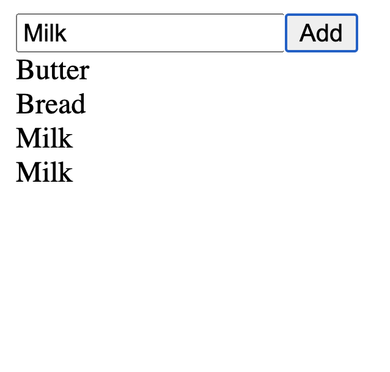

<!-- .slide: id="lesson15" -->

# Basic Frontend - Spring 2021

Lesson 15, Tuesday, 2021-04-27

---

### Lesson overview

* Recap
* Homework
* `document.createElement`
* Practise

---

### Recap: DOM

* What do we remember about DOM?

Dom is an **API**. It allows us to manipulate HTML elements from JavaScript.
<!-- .element: class="fragment" -->

---

```html
<div id="myDiv"></div>
```

What code do we need to write to get access to the `div` element in JavaScript?

```js
let myDivElement = document.getElementById("myDiv");
```
<!-- .element: class="fragment" -->

---

Can you change the `input` below:

```html
<input id="myInput">
```

to the following `input` from JavaScript?

```html
<input min=10 max=20 id="myInput">
```

```js
let myInputElement = document.getElementById("myInput");
myInputElement.min = 10;
myInputElement.max = 20;
```
<!-- .element: class="fragment" -->

---

Can you change the `div` below:

```html
<div id="myDiv"></div>
```

to the following `div` from JavaScript?

```html
<div id="myDiv">Hello!</div>
```

```js
let myDivElement = document.getElementById("myInput");
myDivElement.textContent = "Hello!";
```
<!-- .element: class="fragment" -->

---

### Recap: Homework

See [2021-04-27-shop/index.html](2021-04-27-shop/index.html)

---

So far, we can get elements from HTML and manipulate them.

* We can set and get properties
* properties can be numbers, strings, object, functions...
* But what if we want to create a new element that's not in HTML yet?

---

### Document.CreateElement

```js
let myDiv = document.createElement("div"); // 1
myDiv.textContent = "hello";               // 2
document.body.appendChild(myDiv);          // 3
```

1. Create a new HTML element using `document.createElement`. Pass the type of the element (`div`, `button`, `img`, ...) as string.
2. Set all the properties you like, e.g. `textContent`, `onclick`, ...
3. Tell the browser in which parent element you want the new element to appear. Here, we append it to the document's `<body>`.

---

### Appending elements

Let's say you have this HTML:

```html
<div id="myDiv"></div>
```

How do you turn it to this?

```html
<div id="myDiv"><span>Hello</span></div>
```

* Hint: Use `document.getElementById`, `document.createElement`, the `textContent` property and `appendChild`.

---

### Solution

```js
let myDivElement = document.getElementById("myDiv");
let mySpanElement = document.createElement("span");
mySpanElement.textContent = "Hello";
myDivElement.appendChild(mySpanElement);
```

---

### Create a shopping list app!

It should have one `<input>` field where the user can enter a shopping item. It should have one `<button>`. When the user clicks the button, the text from the `<input>` field should be appended to the shopping list.

 <!-- .element width="250px" style="display: block; margin: 0 auto;" -->

---

### Bonus (difficult!!!)

When the user clicks on a shopping item, remove it from the page.

Hint: set an `onclick` function on your newly created HTML element.
Hint: use the `remove()` method of your item to remove it.
