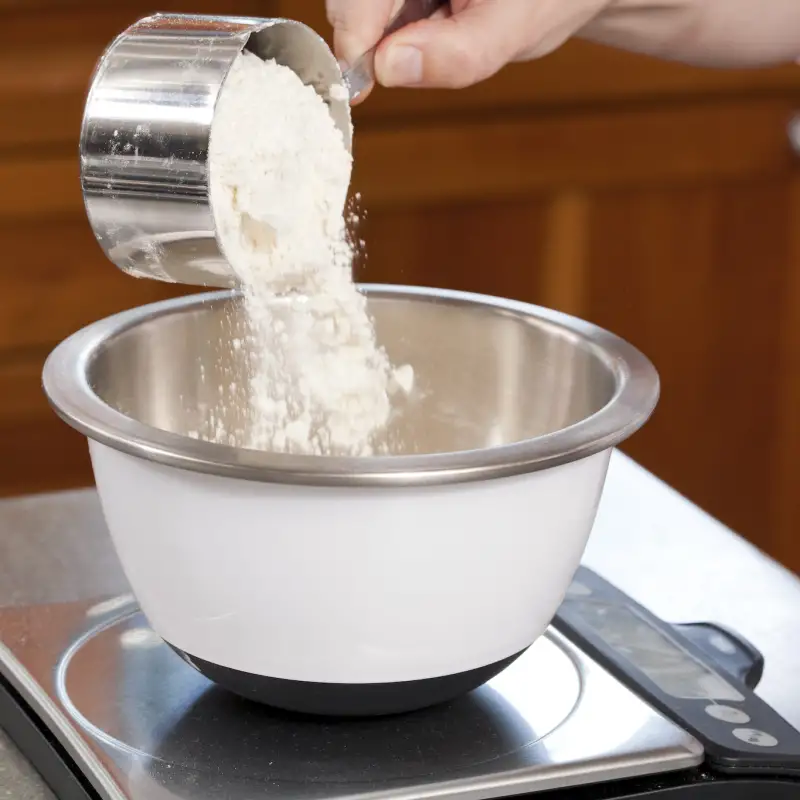

<!-- .slide: id="lesson16" -->

# Basic Frontend - Spring 2021

Lesson 16, Thursday, 2021-04-29

---

<!-- .slide: id="loops" -->

## Loops

---

### Lesson overview

- examples of loops
- while loop
- for loop

---

### Loops

We use loops to run the same code in our programs repeatedly.

More generally, a loop is a way to repeat an action multiple times as long as a certain condition is `true`.

---

### Loops: cake recipe 

Let's say I want to bake a cake:

<div style="display: flex;">

 <!-- .element: style="width: 400px"-->

<div>
Cake recipe:<br>

- 6 eggs
- 3 cups of sugar
- 5 cups of flour
- etc.
</div>
</div>

---

### Loops: cake recipe 

We take an empty bowl and keep our ingredients ready.

We need 5 cups of flour. 

1. What's the action that we need to repeat?
1. For how long do we need to repeat it?

---

### Loops: cake recipe 

1. The action we need to repeat is adding a cup of flour to the bowl
1. We repeat it 5 times 

---

### Loops: cake recipe

We can distinguish different parts in a loop:

- initialization: a starting point
- condition: a test to see if the loop should stop
- update: changes the value checked by the condition
- action: what we want to repeat

It's important that the condition is `false` at some point, otherwise the loop will go on indefinitely.

---

### Loops: cake recipe

- initialization: no flour in the bowl (cupsOfFlour = 0)
- condition: did we put less than 5 cups of flour? (cupsOfFlour < 5)
- update: cups of flour in the bowl (cupsOfFlour++)
- action: add flour to the bowl

---

### Loops: other examples 

- jogging: I want to go and run for 45 minutes 
- painting a room: I want to change the color of the walls to green 
- drinking after jogging: after running for 1 hour I'm thirsty, I need to drink 

Can you distinguish the different parts of the loop in the above examples?

---

### Loops: other examples

Jogging:

- initialization: minutes = 0 
- condition: minutes < 45 
- update: minutes++ 
- action: run

---

### Loops: other examples

Painting a room:

- initialization: isRoomGreen = false
- condition: (! isRoomGreen)
- update: isRoomGreen = true
- action: paintWalls

---

### Loops: other examples 

A farmer needs food for dinner:

 <!-- .element: style="display: block; margin: auto; width: 800px;" -->

<!-- from: https://developer.mozilla.org/en-US/docs/Learn/JavaScript/Building_blocks/Looping_code -->

---

### While loop

Let's see how to make an actual loop in JavaScript.

A `while` loop repeats its body while its `condition` is `true`:

```js
while (condition) {
  // body is executed while "condition" is true
  console.log("Hello from while loop");
}
```

It's similar to an if statement, except that here the body can be executed multiple times
<!-- .element: class="fragment" -->

---

### While loop

```js
let flour = 0; // initialization
while (flour < 175) { // condition
    console.log("Take the flour and put some in the bowl");
    flour++; // update
    console.log("There are now " + flour + "g of flours in the bowl");
}
```

---

### While loop

```js
let bitesOfChocolate = 0;

while (bitesOfChocolate < 10) {
  bitesOfChocolate++;
  console.log("Bites of chocolate: " + bitesOfChocolate);
  console.log("Still hungry.");
}
```

As long as we have had less than 10 bites of chocolate, we will have one more and console.log that we're still hungry.

---

### While loop

A while loop might execute zero to unlimited times:

```js
let isHungry = false; // we just ate
while (isHungry) {
  eat(); // this is never reached!
}
```

---

### While loop

Always make sure that a `while` loop's condition is eventually set to `false`.
Otherwise your loop will run infinitely.

```js
let bitesOfChocolate = 0;

while (bitesOfChocolate < 10) {
  console.log("Bites of chocolate: " + bitesOfChocolate);
  console.log("Still hungry.");
}
  // this code will print "Bites of chocolate: 0" and "Still hungry" until your laptop
  // runs out of battery, you kill the process
  // by closing the browser, you reboot or the universe ends
}

while (isHungry) {
  goRunning(); // going running makes us more hungry
  // loop won't terminate!!!
}
```

---

### Counting

Quiz: Let's `console.log` the numbers from 1 to 5 using a `while` loop.

---

### Counting - solution

Quiz: Let's `console.log` the numbers from 1 to 5 using a `while` loop.

```js
let i = 1; // initialize i with 1
while (i < 6) {
  // repeat this loop until we reach 6
  console.log(i);
  i++; // update i at every step
}
```

---

### Quiz

What will this loop output?

```js
let i = 0;
while (i < 2) {
  console.log(i);
}
```

Answer: 0, until you run out of battery<!-- .element: class="fragment" -->

---

### Quiz

- How many times will the loop run?

```js
let i = 10;
while (i < 15) {
  console.log(i);
  i++;
}
```

Answer: 5 times<!-- .element: class="fragment" -->

---

### Exercises

- Output your name five times
- Output the squares of the first 10 numbers starting with 1 (1, 4, 9, 16, ...)
- Output the sum of the first 10 numbers starting with 1

---

### Exercises - Solutions

Output your name five times

```js
let i = 0;
while (i < 5) {
  console.log("Carlo");
  i++;
}
```

Squaring the first 10 numbers

```js
let i = 1;
while (i < 11) {
  console.log(i * i); // or i ** 2
  i++;
}
```

---

### Exercises - Solutions

Outputting the sum of the first 10 numbers

```js
let i = 1;
let sum = 0;
while (i < 11) {
  sum += i;
  i++;
}
console.log(sum);
```

---

### While loop: recap quiz

1. What can we do with loops?
1. What are the main parts of a loop?
1. Can a loop run 0 times?
1. Can a loop run only 1 time?

---

### While loop: recap

- a loop lets us execute a block of code multiple times
- the block is executed as long as certain condition is true
- we normally need a starting point, initializing some variable
- inside the block that is repeated, we usually update some value to make sure that the loop can stop

---

### Loops and the DOM

Can we actually use loops when interacting with the DOM?

Let's see an example.

---

### Homework 1

1. create a number input and a button
1. when clicking a button, run a function that reads the value from the input
1. inside the function, calculate the sum of the numbers between 0 and this number
1. display the sum on the page

---

### Homework 2

[Box generator](https://github.com/ReDI-School/js-berlin-2021-spring/tree/main/lesson-16-examples/box-generator)

Modify the box generator code so that the number of boxes to display is taken from an input on the page.

Bonus: add other inputs to also change color and sizes of the boxes.

---

