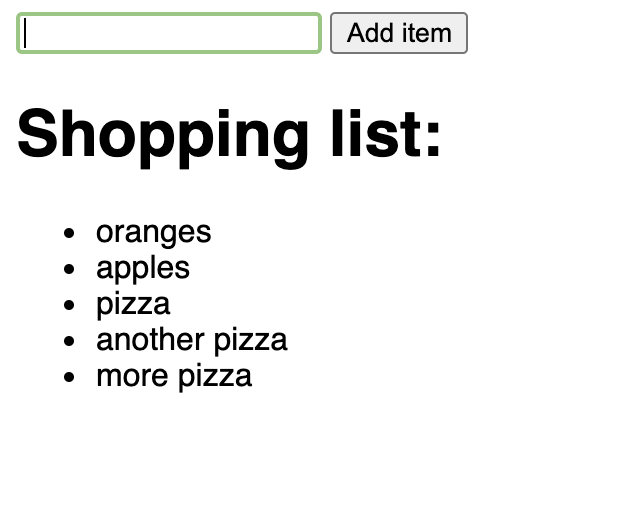
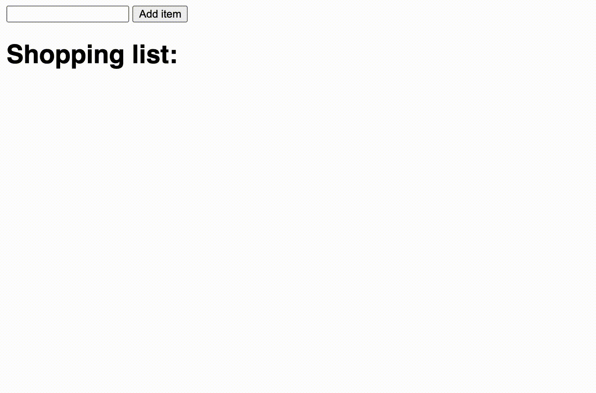

<!-- .slide: id="lesson16" -->

# Basic Frontend - Fall 2020

Lesson 16, Tuesday, 2020-10-20

---

### Lesson overview

1. recap/quiz of the DOM API so far
1. element attributes
1. creating new elements with the DOM API
1. practice


---

### The DOM API

1. what's the DOM API?
  - it's an interface that lets us interact with our web page
  <!-- .element: class="fragment" -->
1. what can we do with it?
  - we can access HTML elements
  <!-- .element: class="fragment" -->
  - we can read from HTML elements
  <!-- .element: class="fragment" -->
  - we can change HTML elements' content
  <!-- .element: class="fragment" -->

---

### The DOM API: examples

Reading a value from an `input`:
```html
<input type="text" id="color" value="green">
```

```js
let colorElement = document.getElementById('color');
let color = colorElement.value;
console.log(color); // green
```
<!-- .element: class="fragment" -->

---

### The DOM API: examples

Changing the value of an `input`:
```html
<input type="text" id="color" value="green">
```

```js
let colorElement = document.getElementById('color');
colorElement.value = "red";
let color = colorElement.value;
console.log(color); // red
```
<!-- .element: class="fragment" -->

---

### The DOM API: examples

Changing the style of a `div`:

```html
<div id="content">Hello</div>
```

```js
let contentElement = document.getElementById('content');
contentElement.style.backgroundColor = "black";
contentElement.style.color = "white";
contentElement.style.fontSize = "32px";
contentElement.style.padding = "16px 32px";
```
<!-- .element: class="fragment" -->

---

### The DOM API: examples

Changing the content of a `div`:

```html
<div id="content">Hello</div>
```

```js
let contentElement = document.getElementById('content');
contentElement.textContent = "Hi!";
```
<!-- .element: class="fragment" -->

---

### The DOM API: examples

Changing the whole `body` element:

```js
document.body.style.backgroundColor = "black";
document.body.style.color = "white";
document.body.style.fontSize = "48px";
document.body.textContent = "Hello!";
```


---

### The DOM API: examples
Clear the contents of a `div`, a `paragraph` and an `input`:

```html
<div id="myDiv">I'm the content of a div</div>
<p id="myParagraph">I'm a paragrpah</p>
<input type="text" id="myInput" value="bla">
```

```js
let myDivElement = document.getElementById('myDiv');
let myParagraphElement = document.getElementById('myParagraph');
let myInputElement = document.getElementById('myInput');

myDivElement.textContent = '';
myParagraphElement.textContent = '';
myInputElement.value = '';
```
<!-- .element: class="fragment" -->

---


### The DOM API

What's the difference between those elements: `h1`, `h2`, `p`, `div`

```html
<h1>This is the main heading</h1>
<h2>This is the sub heading</h2>
<p>And here is a nice <span>paragraph</span> with a span inside.</p>
<div><a href="http://example.com">A link</a> inside a div.</div>
```

and those: `input`, `img`
```html
<input type="text" id="color" value="red">

```

The contents of input and img are controlled by an element attribute.
<!-- .element: class="fragment" -->

---

### The DOM API: element attributes

Attributes let us define certain properties of HTML elements. Can you name any HTML attribute?

- id, class -> common to every element
<!-- .element: class="fragment" -->
- value -> only input elements have it
<!-- .element: class="fragment" -->
- src -> img has it. Also script and a few others
<!-- .element: class="fragment" -->
- href -> only a elements (links) have it
<!-- .element: class="fragment" -->
- onclick -> common to every element
<!-- .element: class="fragment" -->

---

### The DOM API: element attributes

HTML attributes can be added directly in your HTML file

```html
<input id="color" type="text" value="green">
```

`id`, `type` and `value` are all attributes.

And we can access them all in JavaScript:

```js
let colorElement = document.getElementById('color');
console.log(colorElement.id); // "color"
console.log(colorElement.type); // "text"
console.log(colorElement.value); // "green"
```

---

### The DOM API: element attributes

The same goes for other attributes:

```html
<a id="myLink" href="http://example.com">a link</a>
```

```js
let linkElement = document.getElementById('myLink');
console.log(linkElement.href); // "http://example.com"
// let's change the link
linkElement.href = "https://cat-bounce.com/";
```

---

### The DOM API: element attributes

So, if we have an image on our page:

```html

```

Could we change image just by changing the `src` attribute?

Yes. Try it yourself!
<!-- .element: class="fragment" -->

---

### The DOM API: element attributes

Even more, we can add or change the `onclick` attribute directly from JavaScript

```html
<button id="myButton">click me!</button>
```

```js
function scream() {
  console.log('AAAAAAAAAAAAAAHHHH!');
}

let buttonElement = document.getElementById('myButton');
buttonElement.onclick = scream;
```

Can you explain what's going on here?

---

<!-- .slide: id="lesson16:dom-creating-elements" -->

# Creating elements with the DOM API

---

### The DOM API: creating elements

The DOM API lets us create new HTML elements from scratch and add them to the
page.

To do this, we use two other functions provided by the API:

1. `document.createElement()`
1. `document.appendChild()`

Again, it's a 2 step operation: instead of accessing an existing element, we
create a new one; then we "append" (add) it to the page.

---

### The DOM API: creating elements

Let's start with an empty page.
```html
<body>
</body>
```

Let's add a `h1` with some text in it:

```js
let titleElement = document.createElement('h1');
document.body.appendChild(titleElement);
```

That's it! Except that our element is empty. How can we add some text to
`titleElement`?

---

### The DOM API: creating elements

As with any other element, we simply use `textContent`.
```js
let titleElement = document.createElement('h1');
document.body.appendChild(titleElement);
titleElement.textContent = 'Hi!';
```

We can also add the content before appending the element to the page. Same
result:
```js
let titleElement = document.createElement('h1');
titleElement.textContent = 'Hi!';
document.body.appendChild(titleElement);
```

---

### The DOM API: creating elements

What if we want to append inside a `div` instead of the body?

```html
<div id="myDiv"></div>
```

```js
// get access to the div
let divElement = document.getElementById('myDiv');
// create a new h1 element
let titleElement = document.createElement('h1');
// add content to it
titleElement.textContent = 'Hi!';
// append the new element to the div
divElement.appendChild(titleElement);
```

---

### The DOM API: creating elements

We can do the same completely from scratch. Again, an empty page:

```html
<body></body>
```

```js
// create a div element
let divElement = document.createElement('div');
// append it to the body
document.body.appendChild(divElement);

// create a new h1 element
let titleElement = document.createElement('h1');
// add content to it
titleElement.textContent = 'Hi!';
// append the new element to the div
divElement.appendChild(titleElement);
```

---

### The DOM API: exercise

Starting with an empty HTML document, use JavaScript to build a simple page:

- create a `h1` tag with your name in it
- create a `p` tag with some text in it (even a simple "hello" is fine)
- create an `a` tag linking to your favourite website (tip: use the `href`
  attribute)
- BONUS: add an image to the page

Hint: if you keep appending elements to the `body`, they will appear one after
the other

---

### The DOM API: recap 

- we can manipulate existing HTML elements
- we can  create completely new HTML elements, and entire
  pages
- depending on the type of element, we can change the content using the
  `textContent` property or specific attributes
- we can dynamically attach functions to elements using the `onclick` attribute

---

### The DOM API: exercise
##### Create a navigation menu

Create a simple navigation menu starting from a JavaScript array of objects. Use
the files in the folder `nav-menu` as a starting point: 

 <!-- .element width="500px" style="display: block; margin: 0 auto;" -->

-> instructions

---

### The DOM API: exercise
##### Create a navigation menu

Instructions:
1. in the JavaScript file there is an array of objects, representing the links
   for your navigation menu
1. use a loop to iterate the array and create all the necessary elements
1. use the HTML provided in the same file as a guide to know which elements to
   create and in which order to append them

---

### The DOM API: exercise
##### Shopping list 

Create a simple interactive shopping list. Use the files in the folder `shopping-list` as a starting point: 

 <!-- .element width="300px" style="display: block; margin: 0 auto;" -->

-> instructions

---

### The DOM API: exercise
##### Shopping list 

Instructions:

1. use the input to type items you need to buy
1. when clicking on the button, the item is added to an unordered list below
1. after clicking the button, clear the input
1. the HTML is ready, nothing to be done there. Just write the JavaScript code
   to get access to the input value and write the function `addItem()`

-> next page for bonus

---

<!-- .slide: style="font-size: 80%;" -->

### The DOM API: exercise
##### Shopping list 

Bonus (check the video demonstration on the next slide):

1. **cross button**: add a button that when clicked changes the style of the item to appear crossed (tip: the style is `text-decoration: line-through`)
1. **cross button 2**: on the first click, the item appears "crossed". Clicking
   again, it gets "uncrossed". And so on.
1. **priority button**: add another button to indicate the priority through colors:
   the priorities can be: `black` (normal) -> `green` -> `orange` -> `red`.
   On button click, change the colors: if the item is black, change it to green. Then from green to orange, from orange to red, and from red, back to black.

---

### The DOM API: exercise
##### Shopping list with bonus

 <!-- .element width="600px" style="display: block; margin: 0 auto;" -->
