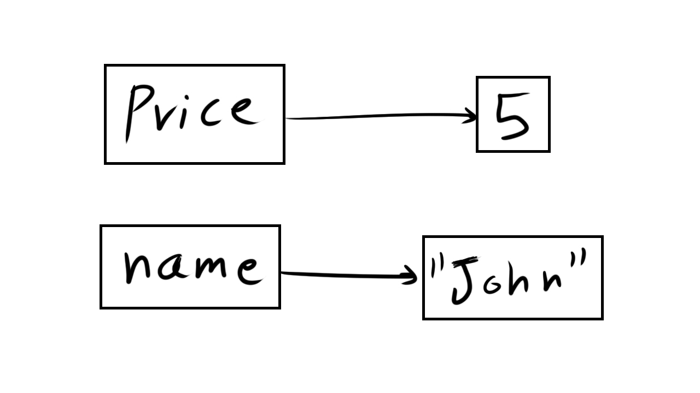

<!-- .slide: id="lesson2" -->

# Basic Frontend - Spring 2020

Lesson 2, Thursday, 2020-02-27

(Please install Visual Studio Code if you haven't already)

---

<!-- .slide: style="font-size:70%" -->

### What is programming?

Programming involves knowing and doing the following things:
* input: Get data from the keyboard, a file, a sensor, or some other device.
* output: Display data on the screen, or send data to a file or other device.
* math: Perform basic mathematical operations like addition and division.
* decisions: Check for certain conditions and execute the appropriate code.
* repetition: Perform some action repeatedly, usually with some variation.

(Source: http://greenteapress.com/thinkpython/thinkpython.pdf, Page 3)

---

### Recap

What did we talk about last lesson?

---

### Recap: data types

Number:
```js
42
-3.1415
```

String:
```js
"John"
'Berlin'
```

Boolean:
```js
true
false
```

Undefined, no value:
```js
undefined
```

---

### Quiz time

The `typeof` operator in JavaScript outputs the data type of a value. Can you guess the output?

```js
typeof 42;
```

```js
"number"
```
<!-- .element: class="fragment" -->

```js
typeof "hello";
```

```js
"string"
```
<!-- .element: class="fragment" -->

```js
typeof true;
```
```js
"boolean"
```
<!-- .element: class="fragment" -->

---

### Quiz time

```js
typeof (1 + 1);
```

```js
"number"
```
<!-- .element: class="fragment" -->

```js
typeof ("1" + "1");
```

```js
"string"
```
<!-- .element: class="fragment" -->

```js
typeof ("1 + 1");
```
```js
"string"
```
<!-- .element: class="fragment" -->

---

### Quiz time

```js
typeof ("Harald" === "Abdullah");
```

```js
"boolean"
```
<!-- .element: class="fragment" -->

```js
typeof (4 < 2);
```

```js
"boolean"
```
<!-- .element: class="fragment" -->

```js
typeof typeof 42;
```
```js
"string"
```
<!-- .element: class="fragment" -->

---

### Using VSCode

* Create a new folder
* In that folder, create a new file (File -> New File)
* Save it as `index.html`:

```html
&lt;html>
  &lt;body>
    &lt;script src="main.js">&lt;/script>
  &lt;/body>
&lt;/html>
```

* Also in that folder, create a new JS file: `main.js`

```js
console.log("Hello from JavaScript");
```

---

### Outputting values

* You can use `console.log` to print values to the console.
* The console will only be visible to developers, _not_ to the visitors of the website.

Example:

```js
console.log("Hello");
console.log(3 * 4 + 5);
```

---

### Browser Console

* Open Chrome browser
* Open your `index.html`
* Where's the console log?
* Open the developer tools (press F12)
* Clock on the "Console" tab
* Do you see the string from `console.log`?

---

<!-- .slide: id="lesson2:variables" -->

# Variables

---

### Variables

But with all these examples, we are just talking about values.

What if I wanted to save some values and use them later?

we use `Variables`!

---

### Variable

A pointer to value.

```js
let price = 5;
let name = "John";
```


<!-- .element: style="text-align:center" -->

---


### Examples:

```js
let priceCoffee = 2;
let priceCappuccino = 3;
let customer = "John";
let company = undefined;
let greeting = "Hello";
let age = 50;
let hasKids = false;
```

Can you guess how can we define a variable?

---

### How do we define a variable?
We write:
* `let`
* the variable name
* `=`
* the value we want
* `;`

---

### Quiz Time

What are the types of the values in the following variables?

```js
let temperature = 24;
let name = "John";
let teacherIsNice = true;
let totalPrice = '12.5';
let deliveryDate = undefined;
```

---

### Quiz Time - solution

```js
let temperature = 24;           // number
let name = "John";              // string
let teacherIsNice = true;       // boolean
let totalPrice = '12.5';        // string
let deliveryDate = undefined;   // undefined
```

---

### Uninitialized variables

A variable that is not initialized with a value is always `undefined`:

```js
let temperature;     // undefined
let name;            // undefined
let isTeacherNice;   // undefined
```

---

### Variables

Variables can be used wherever we can use values:

```js
let firstName = "John";
let lastName = "Smith";
// let fullName = "John" + " " + "Smith";
let fullName = firstName + " " + lastName;
console.log("my full name is " + fullName);
// what is the output here?
// try it with your name!
```

---

### Why is it called variable?

We can modify the value that a variable points to at any time:

```js
let year = 2019;  // at this point, year is 2019
year = 2020;      // now the year is 2020
year = 2021;      // now it's 2021
```

---

### Why do we use variables?

We use variables...

* ... to have a single truth. You declare the variable once, and use it often.
* ... to give names (semantics) to values. `15` could mean a person’s age or number of new messages in his/her feed.
* ... to prevent typing errors - for example Pi `3.141592`

---

### Variable names

You can name your variables whatever you want.
- You can use letters, numbers, and underscore _ (spaces are *not* allowed!)
- Variable name cannot start with a number.

Correct variable names:
```js
let element = 3;
let element3 = 5;
```

Wrong variable names:
```js
let 2squared = 4;
let element-1 = 0;
let full name = 'Anakin Skywalker';
```

---

Giving good and descriptive names to your variables is very important!

Good variable names make the code easier to understand by other developers, and even by yourself!

Not wrong, but bad variable names:
```js
let a = 0;
let _12 = 0;
let asldjf = 0;
let thisisareallylongvariablename = 0;

```

---

In this course, and JavaScript in general, we use 'camelCase'
  - `isStudent`
  - `favoriteFood`
  - `likesGermanFood`

---

Variable names are case sensitive:
```js
let name = 'John';
let Name = 'John';
let NAME = 'John';
```

These are 3 different variables.

---

### naming Boolean variables

When naming boolean variables, it is best to give it a name that describes a yes/no question:

- isMarried
- hasKids
- canExecute

---

### try it!

create 4 variables:
* one for your full name
* one for your age
* one for your favorite city
* one for whether you can speak German or not

`console.log()` all these variables!

---

<!-- .slide: id="lesson2:comments" -->

### Comments

You can write additional information in your code using comments.

Comments are completely ignored by JavaScript, they exist only to help developers.

---

### Comment types

```js
// this is a single-line comment
// anything after // is ignored by JavaScript

let firstName = "John";

let age = 24; // I can also write a comment here!

/*
   this is a multi-line comment

   I can write however many lines I want!
*/
let lastName = "Smith";
```

---

### Execution

JavaScript executes the code from top to bottom, line by line.

JavaScript will ignore comments.


---

### top to bottom, line by line
Wrong:
```js
console.log(name); // WRONG!! the variable "name" is not defined!

let name = "Obi-Wan Kenobi";
```
Correct:
```js
let name = "Obi-Wan Kenobi";

console.log(name); // correct!
```

---

### Recap: Operators

```js
13 + 14;    // 27
13 < 14;    // false
"I live in" + " " + "Berlin"; // "I live in Berlin"
```

These and other operators also work on variables:

```js
let myAge = 13;
let friendAge = 14;
let isFriendYounger = friendAge < myAge;
let city = "Berlin";
let text = "I live in" + " " + city;
```

---

### Exercise

Convert Kilometer to Meter using JavaScript operators:

```js
let distanceInKilometer = 28.5;

// 1 kilometer is 1000 meters
let distanceInMeter = // ???

// output to the console to see the final result
console.log(distanceInMeter);
```

---

### Solution

```js
let distanceInKilometer = 28.5;

// 1 kilometer is 1000 meters
let distanceInMeter = distanceInKilometer * 1000;

// output to the console to see the final result
console.log(distanceInMeter);
```

---

### what we learned

* Variables are pointers to values:
  * We can use operators with variables just like with values

* Use `<script src="xxx.js"></script>` to add a JavaScript file to your HTML webpage.

* Use `//` to write comments.

* Use `console.log(...)` to output values to the console.

---

### Homework

You have an online shop, which sells hats and t-shirts. One of the customers wants to buy 2 hats and 3 t-shirts.

A hat costs 3.99€ and a t-shirt costs 9.99€. What is the total cost?

Create all the variables needed, and output the final result to the console.
